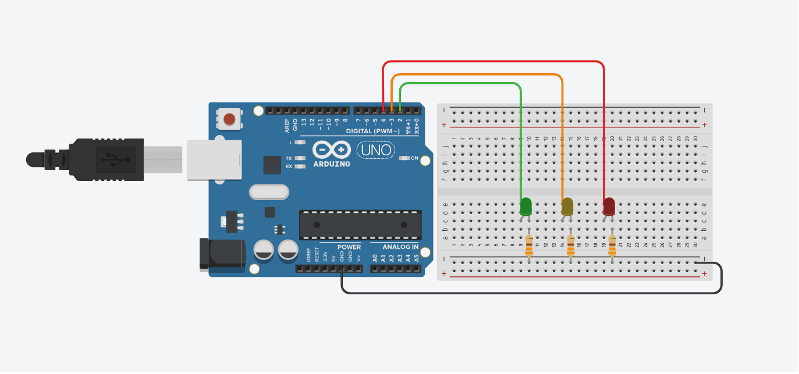
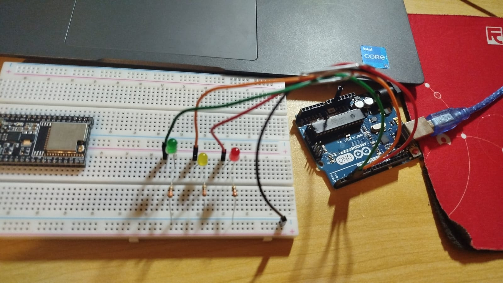
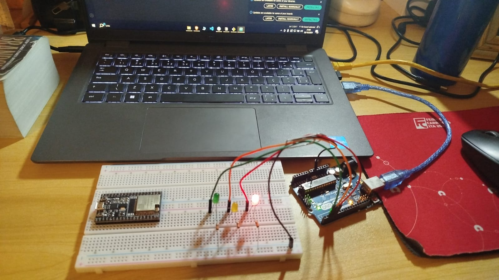
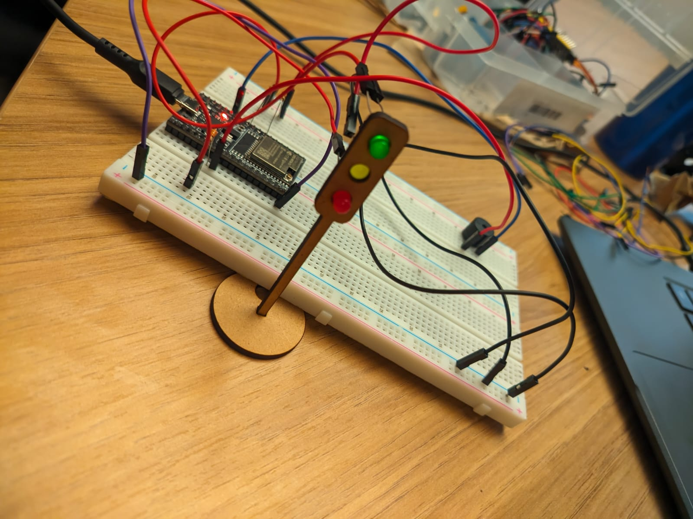

# Ponderada Semana 03 - Construção de semáforo com Arduino e leds

## Aluno: Caio de Alcantara Santos

### 1.0. Objetivos:

&emsp;**Parte 1**: Montagem Física do Semáforo
Você deve realizar a montagem física de um semáforo utilizando LEDs e resistores em uma protoboard. Os LEDs devem representar as cores vermelho, amarelo e verde, seguindo o esquema de um semáforo convencional.

&emsp;Para completar esta etapa:
- Conecte corretamente os LEDs e resistores na protoboard conforme o esquema.
- Certifique-se de usar os resistores adequadamente para proteger os LEDs.
- Organize a disposição dos fios para garantir clareza e facilidade de visualização.

&emsp;**Parte 2**: Programação e Lógica do Semáforo
Você deve programar o comportamento do semáforo para alternar entre as fases vermelho, amarelo e verde, seguindo a lógica abaixo:
- 6 segundos no vermelho
- 2 segundos no amarelo
- 2 segundos no verde
- +2 segundos no verde (simulando um tempo adicional para pedestres terminarem a travessia)
- 2 segundos no amarelo

&emsp;Esse ciclo deve ser repetido continuamente em um loop.

&emsp;Para completar essa etapa:
- Escreva o código para controlar as luzes do semáforo com a temporização exata descrita.
- Teste o código e certifique-se de que as fases estão funcionando corretamente, com as transições e tempos esperados.

&emsp;**Parte 3**: Avaliação de Pares

&emsp;Nesta atividade, todos os alunos serão ser avaliadores e avaliados.
Cada atividade deverá ser avaliada por pelo menos dois alunos segundo os critérios do barema.

### 2.0. Componentes utilizados

| Componente            | Quantidade | Preço Unitário (R$) | Preço Total (R$)   |
|-----------------------|------------|----------------------|-------------------|
| Arduino Uno R3        | 1          |  **R$236,55**        |  **R$236,55**     |
| Jumper macho-macho    | 9          |  **R$0,19**          |  **R$1,71**       |
| LED verde             | 1          |  **R$0,24**          |  **R$0,24**       |
| LED amarelo           | 1          |  **R$0,24**          |  **R$0,24**       |
| LED vermelho          | 1          |  **R$0,24**          |  **R$0,24**       |
| Resistor 330Ω         | 3          |  **R$0,07**          |  **R$0,21**       |
| Protoboard            | 1          |  **R$56,90**         |  **R$56,90**      |
| Buzzer 5v             | 1          |  **R$4,90**          |  **R$4,90**       |
| **Total**             |            |                      |  **R$300,09**     |

*Valores retirados do site RoboCore.*

### 3.0. Montagem das conexões

&emsp;O esquemático das conexões pode ser visto na imagem abaixo:

<div align="center">
   
   <sub>Figura 1 - Esquemático das ligações do semáforo </sub>

    
   
   <sup>Fonte: Material produzido pelo autor (2024)</sup>
   
</div>

&emsp;A partir do esquemático as seguintes ligações foram feitas:
* GND do arduino conectado, via jumper, na trilha de negativos da *protoboard*;
* Resistores de 330r conectando o terminal negativo de cada um dos leds ao GND do Arduino via trilha de negativos da *protoboard*;
* Terminal positivo do led verde conectado, via jumper, ao pino D2 do Arduino;
* Terminal positivo do led amarelo conectado, via jumper, ao pino D3 do Arduino;
* Terminal positivo do led vermelho conectado, via jumper, ao pino D4 do Arduino;

&emsp;As ligações físicas podem ser vistas na imagem abaixo:

<div align="center">
   
   <sub>Figura 2 - Ligações físicas do semáforo </sub>

    
   
   <sup>Fonte: Material produzido pelo autor (2024)</sup>
   
</div>

### 4.0. Programação do Arduino
&emsp;O código fonte do programo para o Arduino está localizado na pasta ```codigo_semaforo/codigo_semaforo.ino```.
&emsp;No código, foi definida uma classe Led, que é responsável por abstrair o controle de liga/desliga dos leds através dos métodos on() e off():

```cpp
class Led {
  private:
    byte pin;
  public:
    Led(byte pin){
      this->pin = pin;
      init();
    }

    void init() {
      pinMode(pin, OUTPUT);
      off();
    }

    void on() {
      digitalWrite(pin, HIGH);
    }

    void off() {
      digitalWrite(pin, LOW);
    }

};
```

&emsp;Após isso, é realizado o instanciamento dos leds verde, amarelo e vermelho. A função setup pode ser deixada vazia. Já a função loop contém a lógica principal do programa, que se **repetirá infinitamente**:

```cpp
void loop() {
  // - 6 segundos no vermelho
  GREEN_LED.off();
  YELLOW_LED.off();
  RED_LED.on();
  delay(6000);

  // - 2 segundos no amarelo
  YELLOW_LED.on();
  RED_LED.off();
  delay(2000);

  // - 2 segundos no verde
  GREEN_LED.on();
  YELLOW_LED.off();
  RED_LED.off();
  delay(2000);

  // - +2 segundos no verde (simulando um tempo adicional para pedestres terminarem a travessia)
  for (int i = 0; i <= 2; i++) {
    GREEN_LED.on();
    delay(500);
    GREEN_LED.off();
    delay(500);
    i++;
  }

  // - 2 segundos no amarelo
  YELLOW_LED.on();
  RED_LED.off();
  GREEN_LED.off();
  delay(2000);

}
```

&emsp;Neste função loop, o código é responsável por:
* Deixar apenas o led vermelho aceso por 6 segundos;
* Deixar apenas o led amarelo aceso por 2 segundos;
* Deixar apenas o led verde aceso constantemente por 2 segundos;
* Deixar apenas o led verde piscando por 2 segundos, simulando um tempo exetra para os pedestres finalizarem a travessia;
* Deixar apenas o led amarelo acesso por 2 segundos;


### 5.0. Funcionamento do semáforo

&emsp;O vídeo de funcionamento do semáforo pode ser encontrado na pasta ```assets/video_semaforo.mp4```.


<div align="center">
   
   <sub>Figura 3 - Imagem do semáforo em funcionamento </sub>

    
   
   <sup>Fonte: Material produzido pelo autor (2024)</sup>
   
</div>

&emsp;Após fazer o *upload* do código para o Arduino através da Arduino IDE, o programa começará a funcionar de acordo com a lógica para o qual foi programado. 

### 6.0. Semáforo no ESP32

&emsp;Para adaptar o sistema para o microcontrolador ESP32, foi necessário alterar as portas nas quais os leds estão conectados. Além disso, foi adicionado um *buzzer* no circuito, que irá apitar enquanto o led verde pisca, alertando os pedestres. No final, o circuito ficou assim, na protoboard:

<div align="center">
   
   <sub>Figura 4 - Imagem da montagem do circuito com ESP32 </sub>

    
   
   <sup>Fonte: Material produzido pelo autor (2024)</sup>
   
</div>

&emsp;Por fim, também existe também um vídeo na pasta *assets*, demonstrando o funcionamento no semáforo com ESP32 e buzzer.

### 7.0. Avaliação de pares

#### Avaliador: Kaio Vittor Martins Silva

| Critério                                                                                                 | Contempla (Pontos) | Contempla Parcialmente (Pontos) | Não Contempla (Pontos) | Observações do Avaliador |
|---------------------------------------------------------------------------------------------------------|---------------------|---------------------------------|-------------------------|--------------------------| 
| Montagem física com cores corretas, boa disposição dos fios e uso adequado de resistores                | 3              | -                          | -                       |   Está tudo dentro do adequado                       |
| Temporização adequada conforme tempos medidos com auxílio de algum instrumento externo                  | 3              | -                          | -                       |                 Os tempos apresentados estão de acordo         |
| Código implementa corretamente as fases do semáforo e estrutura do código (variáveis representativas e comentários) | 3              | -                          | -                       |      Código está organizado e otimizado                    |
| Extra: Implementou um componente de liga/desliga no semáforo e/ou usou ponteiros no código              |  1              | -                          | -                       |       A funcionalidade do buzzer está adequada                   |
|                                                                                                         |                     |                                 |                         | **Pontuação Total: 10**       |


#### Avaliador: Eduardo Fidelis Chaves  

| Critério                                                                                                 | Contempla (Pontos) | Contempla Parcialmente (Pontos) | Não Contempla (Pontos) | Observações do Avaliador |
|---------------------------------------------------------------------------------------------------------|---------------------|---------------------------------|-------------------------|--------------------------| 
| Montagem física com cores corretas, boa disposição dos fios e uso adequado de resistores                | 3              | -                          | -                       |                          |
| Temporização adequada conforme tempos medidos com auxílio de algum instrumento externo                  |  3              | -                          | -                       |   teste                       |
| Código implementa corretamente as fases do semáforo e estrutura do código (variáveis representativas e comentários) | 3              | -                          | -                       |  teste                        |
| Extra: Implementou um componente de liga/desliga no semáforo e/ou usou ponteiros no código              | 1              | -                          | -                       | teste                         |
|                                                                                                         |                     |                                 |                         | **Pontuação Total: 10**       |
